# TALLER 5, VIRTUALIZACION Y CONTENEDORES EN DOCKER

## PREREQUISITOS
Estos son los requisitos con los cuales se trabajó este proyecto

* [Docker desktop](https://www.docker.com/products/docker-desktop/) - Motor de contenedores
* [Java version 17](https://www.oracle.com/co/java/technologies/downloads/) - Lenguaje de programación usado.
* [Maven](https://maven.apache.org/download.cgi) - Gestor de dependencias del proyecto
* [Git](https://git-scm.com/downloads) - Gestion de versiones del proyecto 

## MONTAJE Y EJECUCIÓN

### ejecución del proyecto

```bash
java -cp "target/classes;target/dependency/*" edu.eci.arep.taller5.SparkWebServer
```
se usa el puerto PORT = 57000

### Montaje del docker
Dentro de la carpeta taller5, ejecutamos el siguiente comando que usara el Dockerfile

```bash
docker build --tag dockersparkprimer .
```
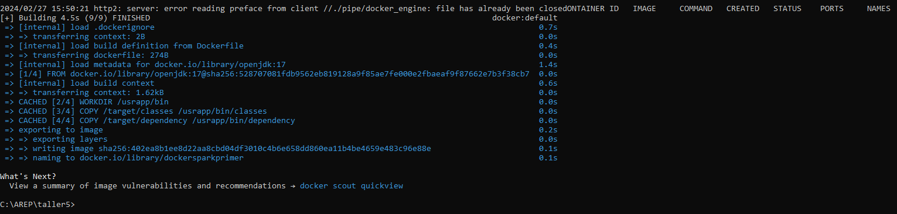

Luego se pone a correr una serie de contenedores con los siguientes comandos
```bash
docker run -d -p 34000:57000 --name firstdockercontainer dockersparkprimer
docker run -d -p 34001:57000 --name firstdockercontainer2 dockersparkprimer
docker run -d -p 34002:57000 --name firstdockercontainer3 dockersparkprimer
```
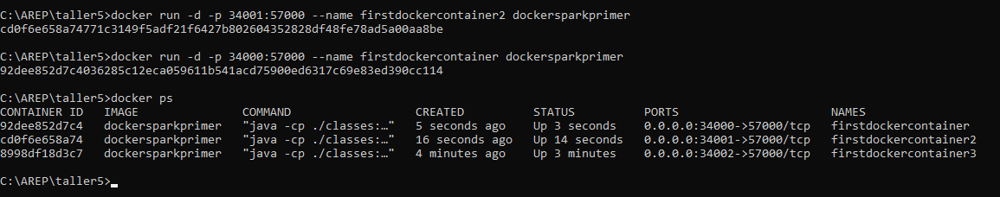

### Usando docker compose u MongoDb

usando el archivo docker-compose.yml y el siguiente comando para componer nuestros containers y un container de MongoDb:
```bash
docker-compose up -d
```
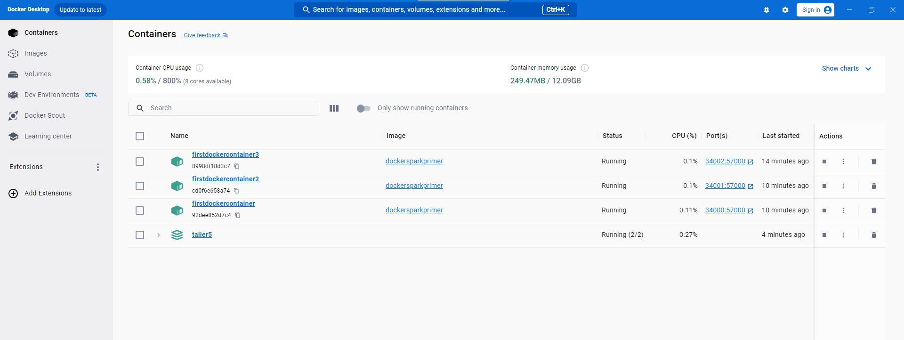
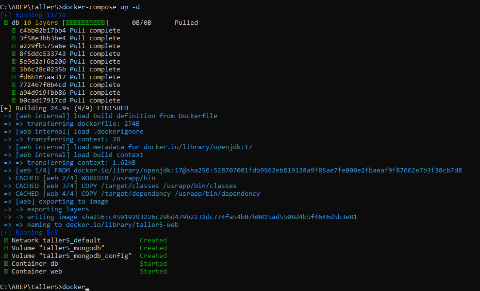

### Subiendo imagen a docker hub
 usamos el siguiente comando mostrado en la imagen para hacer el push, anteriormente damos un tag a la imagen
 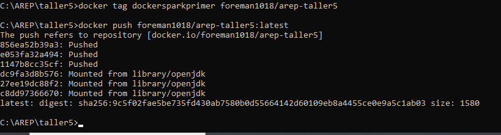

* comando usado para el tag
  ```
  docker tag dockersparkprimer foreman1018/arep-taller5 
  ```
## EJERCICIO PARA DOCKER, MODIFICACION DE PROYECTO CON SERVICIOS REST
Se modifico la clase de **SpartWebServer.java** para que retorne diferentes servicios para realizar dichas operaciones:
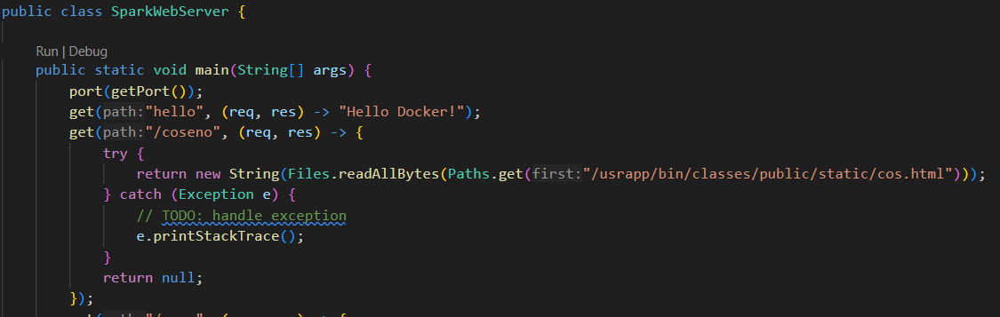

y siguiendo esta estructura, se añadieron los diferentes servicios.

Luego se volvió a crear la imagen correspondiente en docker para montar un contenedor con el servidor java funcionando
.png)

Ademas, con esta modificacion, se volvió a crear la composición de contenedores
.png)

como prueba de ello, se muestra el resultado final de los contenedores montados:
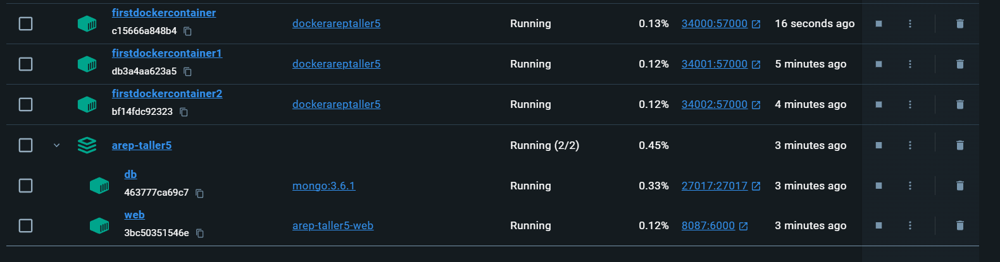

y el resultado se sube a [Docker Hub](https://hub.docker.com/)

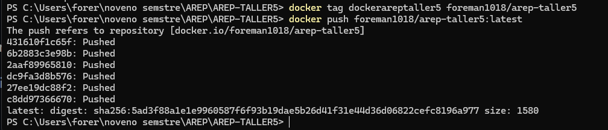


- Para los siguientes calculos, como se mostró anteriormente, se montaron 3 contenedores para su ejecución y prueba, con todos funciona, por lo cual se dejara una URL de prueba por cada servicio.
### Servicio para calcular Sin
```
http://localhost:34000/seno
```
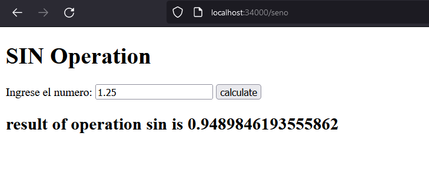
### Servicio para calcular Cos
```
http://localhost:34000/coseno
```
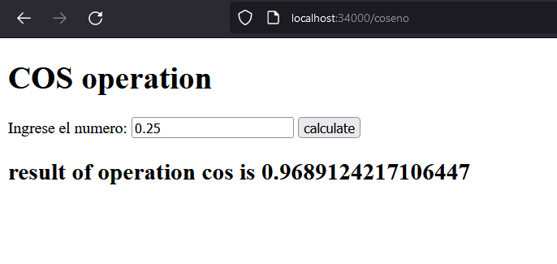
### Servicio para Calcular palindormos
```
http://localhost:34000/palindromo
```
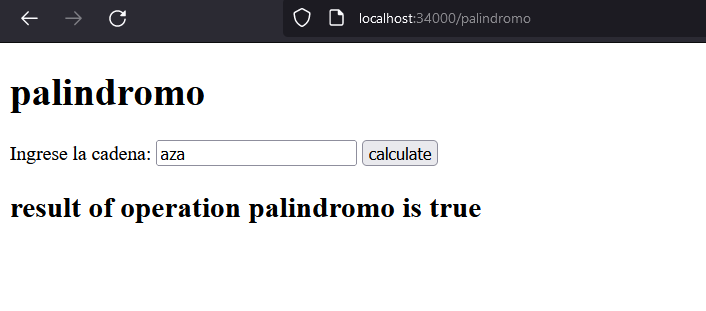
### Servicio para calcular la magnitud de un vector
```
http://localhost:34000/magnitud
```
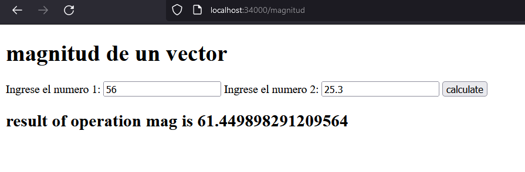
## DESCARGA DE LA IMAGEN Y USO LOCAL
Para poder realizar pruebas localmente, ejecute el siguiente comando en consola:
```
docker pull foreman1018/arep-taller5:latest
```

luego ejecute el siguiente comando para poner en funcionamiento un contenedor con la imagen descargada
```
docker run -d -p 34000:57000 --name proofcontainer foreman1018/arep-taller5
```

y puede realizar pruebas con las urls de los servicios suministrados
## AUTOR
* **Santiago Forero Yate** - [santiforero1018](https://github.com/santiforero1018)
## Agradecimientos

* Especial Agradecimiento al profesor [Luis Daniel Benavides Navarro](https://ldbn.is.escuelaing.edu.co/) por brindar el conocimiento necesario en la realización de este trabajo
